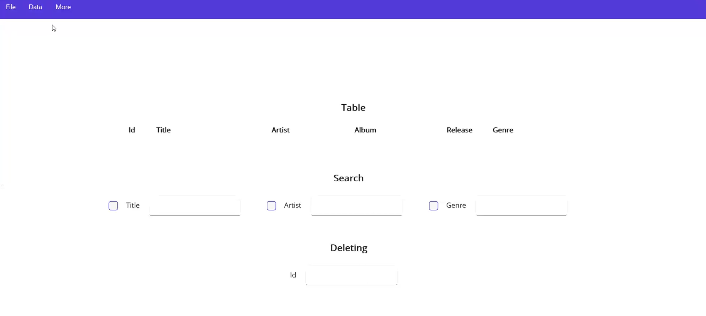
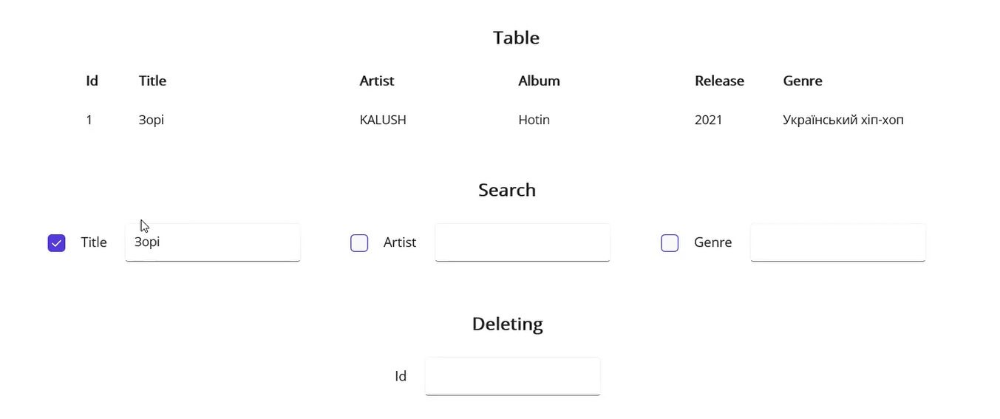
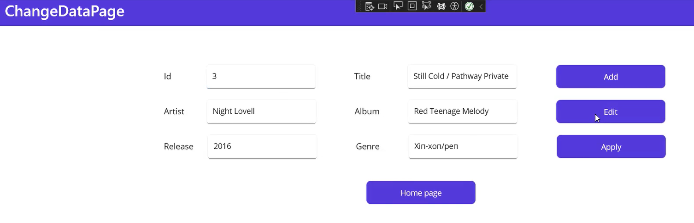

# 🎵 Music Library Search App

A cross-platform **.NET MAUI** app to manage your music library.  
View, search, add, edit, and delete songs stored in a JSON file.

---

## 🚀 Features

- View songs in a table (ID, Title, Artist, Album, Release, Genre)
- Search by Title, Artist, or Genre
- Add, Edit, and Delete songs by ID
- Load and save library as JSON
- Reset form & navigate between pages

---

## 📷 Screenshots

| Main Page                         | Search & Delete                   | Edit Song                         |
| --------------------------------- | --------------------------------- | --------------------------------- |
|  |  |  |

---

## ⚡ Quick Start

### Prerequisites

- [.NET 7 SDK](https://dotnet.microsoft.com/download/dotnet/7.0)
- Visual Studio 2022+ with **.NET MAUI workload**

📁 JSON Structure
[
{
"Id": 1,
"Title": "Song Title",
"Artist": "Artist Name",
"Album": "Album Name",
"ReleaseYear": "2023",
"Genre": "Pop"
}
]

🛠 Technologies

- .NET MAUI
- C# & XAML
- JSON Serialization
